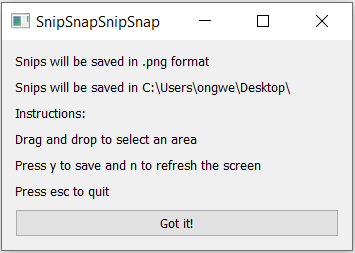
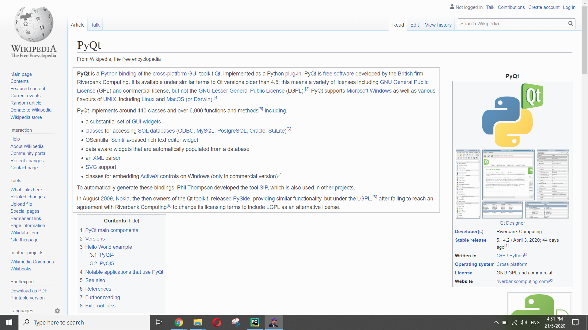

# SnipSnapSnipSnap
Python snipping tool created using the Pyqt5 and Pillow packages

Referenced from https://github.com/harupy/snipping-tool (thanks!)

## Motivation
1. Snipping tool is a very useful application, however, it requires users to manually examine each snip via a pop-up and decide whether to save it, and where to save the snip. 
Although a minor problem, it can be quite frustrating, especially if one is working on saving a large number of snips. This application helps to remove some of the 
delays by allowing the user to decide on their desired file format (png/jpg) and save location beforehand, and whether to save a snip by simply pressing y/n on their 
keyboard.

2. This is a stepping stone towards an application designed to make summarizing information more efficient that is currently in progress.

## Compatibility
This application was created on PyCharm on a Windows 10 device with the packages listed in environment.yml.

## Features:
1. Take in user inputs of desired file format and save location

2. Instructions on using application

3. Actual application

Drag and drop to select snip area

Press y to save a snip, green background color shows to feedback to user that snip has been saved successfully

Press n to not save a snip, red background color shows to feedback to user that snip has not been saved

## Help and support
Please let me know if it works on your device and all suggestions are greatly welcomed!
